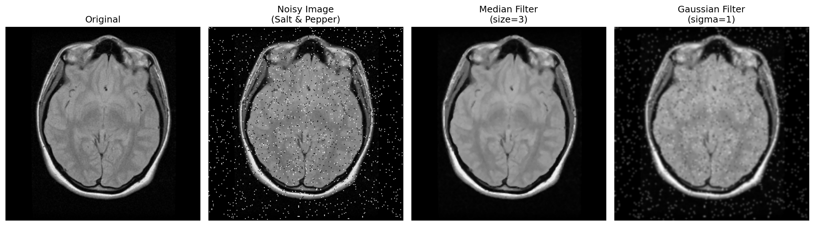

# Task 3 — Image Preprocessing: Smoothing

## Overview

This task applies **salt & pepper noise** to a brain MRI slice and compares two filters — Median and Gaussian — for noise reduction. The goal is to understand which filter is appropriate in different medical imaging scenarios.

---

## What is Salt & Pepper Noise?

Salt & pepper noise randomly sets pixels to extreme values:
- **Salt** → pixel set to maximum brightness (900 in our case)
- **Pepper** → pixel set to 0 (black)

In this task, 4% of all pixels are corrupted (2% salt, 2% pepper).

---

## Filters Applied

### Median Filter (`ndimage.median_filter`, size=3)

Replaces each pixel with the **median** of its 3×3 neighborhood (9 pixels sorted, middle value chosen).

```python
median_filtered = ndimage.median_filter(noisy_img, size=3)
```

**How it handles salt & pepper:**
```
Neighborhood:                    Sorted:
[100, 120, 110]
[115, 900, 105]  →  [100,105,110,112,115,118,120,125,900]
[112, 118, 125]                              ↑
                                        median = 115 ✅
```
The outlier (900) ends up last in the sorted list — it never reaches the middle, so it is completely ignored.

**Suited for:** Salt & pepper noise, preserving sharp edges
**Not suited for:** Thin structures like blood vessels — if narrower than the kernel, the vessel pixel becomes an outlier in its own neighborhood and gets replaced by background

---

### Gaussian Filter (`ndimage.gaussian_filter`, sigma=1)

Replaces each pixel with a **weighted average** of its neighborhood. The `sigma` parameter controls how wide the blur spreads — larger sigma = stronger blurring.

```python
gaussian_filtered = ndimage.gaussian_filter(noisy_img, sigma=1)
```

**How it handles salt & pepper:**
```
Neighborhood with salt pixel (900):
Weighted average ≈ 200 ❌
(900 still influences the result, just diluted into neighbors)
```

**Suited for:** General/random scanner noise (e.g. thermal noise in MRI)
**Not suited for:** Salt & pepper noise (outliers still influence the average), images where edge sharpness must be preserved

---

## Results



| | Median Filter | Gaussian Filter |
|---|---|---|
| Salt & pepper noise | ✅ Removes completely | ❌ Blurs but leaves artifacts |
| Edge preservation | ✅ Sharp edges kept | ❌ Edges slightly blurred |
| Thin structures (vessels) | ❌ Risk of erasure | ✅ Safer |
| General scanner noise | ⚠️ Overkill | ✅ Best choice |

---

## Typical Medical Artifacts

- **Median reduces:** Detector spike artifacts, random bright/dark pixel errors from hardware malfunctions
- **Gaussian reduces:** General thermal/electronic scanner noise common in MRI receiver coils

---

## How to Run

1. Open `exercise2_task3.ipynb` in [Google Colab](https://colab.research.google.com)
2. Upload your DICOM dataset into a folder called `dataset1/`
3. Run all cells — the notebook will display the original, noisy, median filtered, and gaussian filtered images side by side
