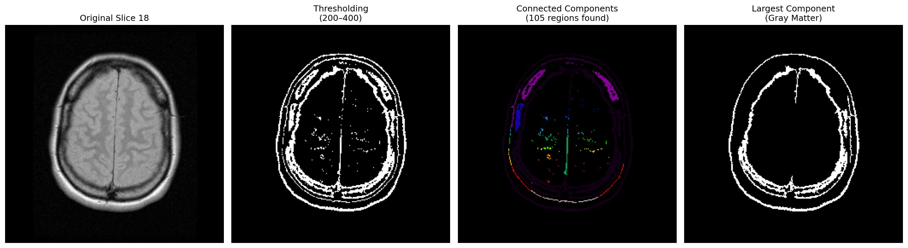

# Task 4 — Image Segmentation

## Overview

This task segments **brain gray matter** from MRI slice 18 using **thresholding**, then refines the result using the provided **Connected Component Analysis (CCA)** code.

---

## Approach

### Step 1: Thresholding
Every pixel with intensity between 200 and 400 is labeled as tissue, everything else as background.

```python
segmentation = (img >= threshold_low) & (img <= threshold_high)
```

**Why it's imperfect:** Different tissues in MRI share overlapping intensity ranges — thresholding has no concept of shape or location, so other structures with similar brightness also get picked up. The **partial volume effect** (boundary pixels containing mixed tissue signals) adds further incorrect detections.

---

### Step 2: Connected Component Analysis (provided code)
Labels each connected group of white pixels separately, then keeps only the largest — which corresponds to gray matter.

```python
# Label connected components
label_im = label(segmentation)

# Calculate statistics over all regions
regions = regionprops(label_im)

# Sort regions in ascending order of size
lst_sorted = sorted(regions, key=lambda x: x.area)

# Take the largest region
graymatter = label_im == lst_sorted[-1].label
```

| Region | Area (pixels) |
|---|---|
| Largest (gray matter) | 3767 |
| 2nd largest | 244 |

The largest region is dramatically bigger than all others — confirming it is the gray matter structure.

---

## Results



Left to right: Original → Thresholding → After CCA (Gray Matter)

---

## How to Run

1. Open `exercise2_task4.ipynb` in [Google Colab](https://colab.research.google.com)
2. Upload `brain_018.dcm` into a folder called `dataset1/`
3. Run all cells top to bottom
